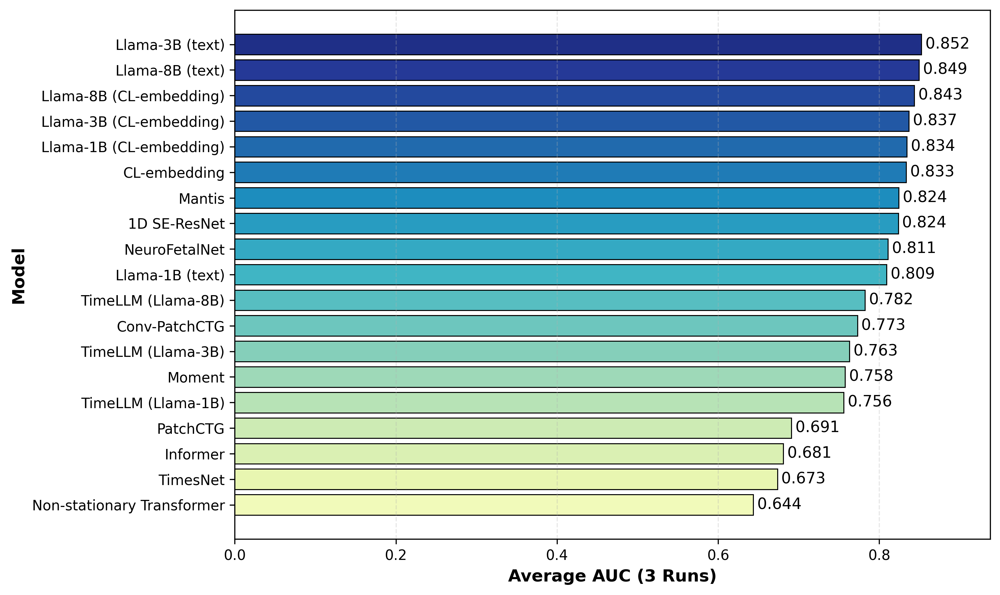

# Large-language-models-surpass-domain-specific-architectures-for-cardiotocography
In this study, we present the first comprehensive benchmark of state-of-the-art architectures for automated antepartum CTG classification. Over 2,500 20-minutes recordings were used to evaluate over 15 models spanning domain-specific, time-series, foundation, and language-model categories under a unified framework. 

## Overview 
This repository provides example code for fine-tuning Llama models that achieved the best performance. It also includes additional examples, such as the complete instruction set used with GPT-5 mini. The code can be used in conjunction with your antepartum dataset for evaluation purposes. Other publicly available models may be evaluated using their respective codebases, which are accessible online. Please refer to the publication for further details. 

## Instruction
1. Your training script expects four NumPy files with these exact variable names when loaded:
```
control_data = np.load(CONTROL_DATA_PATH, allow_pickle=True)
adverse_data = np.load(ADVERSE_DATA_PATH, allow_pickle=True)
control_data_val = np.load(CONTROL_VAL_PATH, allow_pickle=True)
adverse_data_val = np.load(ADVERSE_VAL_PATH, allow_pickle=True)
```
2. Each .npy file must contain a Python dict with exactly these keys:
  - "fhr_segments"
  - "toco_segments" with shape (N, T) where N = number of records, T = fixed time-length

## Result


## Notes
1. The study and dataset are intended for antepartum evaluation, specifically for CTG recordings obtained prior to the onset of labor. Model performance may differ in the intrapartum setting.
2. The study was conducted using CTG data split at the patient level to prevent data leakage. We strongly encourage users to include as many unique patients as possible. Our training set comprises more than 3,000 distinct patients.
3. Due to the input representation requirements of Llama models, the time-series data are formatted as textual sequences rather than processed in a conventional numerical time-series format.
